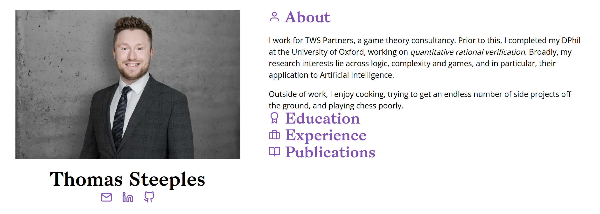

# The creation story

31st March 2024

As is customary with over-engineered websites, we need a blog post to explain how it works.

## In the beginning...

The first incarnation of my website came about in March 2019: I had just started my PhD and wanted some way of communicating to the world that I wasn't completely tech-illiterate. All I needed and wanted my website to be was a short calling card/CV, so it was just one page, with a short blurb about myself, a list of my publications, my work experience and my email. With this short list of requirements, I decided to opt for a static site generator, and as my friends were using [Hugo](https://gohugo.io/) at the time, and it looked kinda cool, I settled for that. I used the [aafu](https://github.com/darshanbaral/aafu) theme and even now you can still see its influence on my current site.

<figure>
    
    <figcaption>The aafu Hugo template.</figcaption>
</figure>

This worked pretty well for a while. But a year or so went by and when I went to update my site, Hugo wimped out (looking at Hugo's releases on Github, there's a least one release labelled as having breaking changes in this time period). Faced with a bunch of errors that I was either too lazy or stupid to understand, I decided I wanted something I really _understood_; something that I'd made with my _own two hands_.  

## If you want something done correctly...

My website was a single page with maybe 250 words total. It wasn't exactly huge in scope. So I decided to write the HTML, CSS and Javascript myself, with a small Bash script to put it all together - I used <code>cleancss</code> and <code>uglifyjs</code> to compress my CSS and Javascript respectively.

This actually was a pretty robust approach for threeish years: I wasn't at the mercy of any third-party dependencies, build times were instantaneous and it did everything I needed it to do. The only problem was that it all looked kinda sh*t. But that was ok! I was gunning for that "MIT professor, hand-coded since 1995" look, to really solidify my academic credentials.

<figure>
    
    <figcaption>My &quot;hand-coded&quot; website.</figcaption>
</figure>

Let's just pretend that the lack of <code>margin</code> or <code>padding</code> on the section titles was a conscious decision.

## The big update

My last site worked well enough, but as the years went by, with me becoming older and wiser, I decided I should expound my views unto the people, and this meant having full "blog it like it's 2006" functionality. If I was taking the opportunity to build this in, I thought I should also tick off a few items that had been on my wishlist for years, but had never justified the individual effort in my mind:
- Something with Markdown → HTML compilation;
- Something which supported mathematics typesetting;
- Something that used a fancy front-end framework (largely for my own education);
- Something that ultimately looked a bit slicker and a bit more professional;

My current website is built with React and Typescript, using the Vite build system. I write the blog posts in Markdown, and render them to HTML server-side. For this, I wrote a Vite plugin that uses the [unified](https://unifiedjs.com/) ecosystem to convert Markdown posts into a React component that I could import:

<pre>
<code class="language-ts">
import { Eta } from "eta";
import path from "path";
import rehypeHighlight from "rehype-highlight";
import rehypeKatex from "rehype-katex";
import rehypeRaw from "rehype-raw";
import rehypeStringify from "rehype-stringify";
import remarkMath from "remark-math";
import remarkParse from "remark-parse";
import remarkRehype from "remark-rehype";
import { unified } from "unified";
import { transformWithEsbuild } from "vite";

// FNV-1a
function hash(str: string) {
  let res = BigInt(0x811c9dc5);
  for (let i = 0; i &lt; str.length; i++) {
    res ^= BigInt(str.charCodeAt(i));
    res *= BigInt(0x01000193);
    res &= BigInt(0xffffffff);
  }
  return res;
}

export default function mdProcessorPlugin() {
  return {
    name: "markdown-processor",

    async transform(src: string, id: string) {
      const mdRegex = /.*.md$/;
      if (mdRegex.test(id)) {
        let html = String(
          await unified()
            .use(remarkParse)
            .use(remarkMath)
            .use(remarkRehype, { allowDangerousHtml: true })
            .use(rehypeRaw)
            .use(rehypeKatex, { output: "mathml" })
            .use(rehypeHighlight)
            .use(rehypeStringify, { closeSelfClosing: true })
            .process(src)
        );

        const backtickRegex = /(?&lt;!\\)`/g;
        html = html.replaceAll(backtickRegex, "\\\`");
        const dollarRegex = /(?&lt;!\\)\$/g;
        html = html.replaceAll(dollarRegex, "\\\$");

        const imports = {};
        const replacer = (match: string, p1: string, p2: string) =&gt; {
          let res = "";
          if (p1 in imports) {
            res = imports[p1];
          } else {
            res = "n" + hash(p1);
            imports[p1] = res;
          }
          return "&lt;img src=${" + res + "}" + " " + p2 + " " + "/&gt;";
        };

        const assetRegex = /&lt;img src="([^"]*)" (.*) \/&gt;/g;
        html = html.replaceAll(assetRegex, replacer);

        const importStatements = Object.entries(imports).map(
          ([k, v]) =&gt; `import ${v} from "${k}";`
        );

        const eta = new Eta({ views: path.join(__dirname, "../templates") });
        const res = eta.render("./blog-post.eta", {
          importStatements: importStatements,
          html: html,
        });

        return transformWithEsbuild(res, id, {
          loader: "tsx",
          jsx: "automatic",
        });
      }
    },
  };
}
</code>
</pre>

with the following [Eta](https://eta.js.org/) template:
<pre>
<code class="language-ts">
import MainContainer from "../MainContainer.tsx";

&lt;% it.importStatements.forEach(function(stmt){ %&gt;
    &lt;%~ stmt %&gt;
&lt;% }) %&gt;

const html = `&lt;%~ it.html %&gt;`;
export default function Post() {
   return (
       &lt;MainContainer homeButtonPresent={true}&gt;
           &lt;div className="blog-post" dangerouslySetInnerHTML={{__html : html}} /&gt;
       &lt;/MainContainer&gt;
   );
}
</code>
</pre>

To be honest, I'm not entirely happy about the backtick and dollar escaping logic (which is needed so they don't interfere when the html string is embedded in a template literal) - I already have to go through and escape some characters already (in particular, &lt; and &gt;, so they're not interpreted as HTML tags, as well as backticks that are already preceded by two backslashes). However, it works _well enough_ as is and [I'll worry about coming up with something more sophisticated as time goes on](https://skeptics.stackexchange.com/questions/50691/did-milton-friedman-say-that-nothing-was-so-permanent-as-a-temporary-government). Using Eta as a dependency also feels like overkill, but I feel it givies a nice separation of concerns.

And finally, as promised, we also have maths working:
$$
f(a) = \frac{1}{2\pi i} \oint_\gamma \frac{f(z)}{z-a}\, \mathrm{d}z
$$

If you would like to investigate the source in detail, my website can be found on [Github](https://github.com/thomasfsteeples/personal_website).
